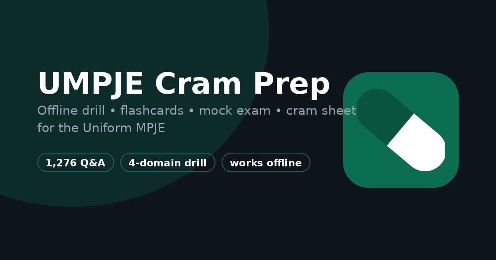

# TiffLex: UMPJE Review

A free, offline review tool for the **Uniform MPJE** (Multistate Pharmacy Jurisprudence Examination), a 1,500-question drill bank of fully original, primary-source-grounded questions, flashcards, a timed mock exam, and a fact-checked cram sheet, all in a single page that keeps working with zero internet connection.

**Live app:** https://jfpharmd.github.io/TiffLex/
**About page:** https://jfpharmd.github.io/TiffLex/welcome.html



## Features

- **Drill mode**: multiple choice by domain, with the answer and explanation shown right after each question
- **Flashcards**: the same question bank as rapid-fire flip cards for recall practice
- **Mock exam**: a timed, 120-question simulation matching the real exam's format and seat time
- **Cram sheet**: a condensed, domain-organized reference of the numbers, forms, and deadlines that actually get tested, with the spots where common commercial question banks are outdated flagged explicitly
- **Fully offline**: everything (question bank, cram sheet, your progress) lives in the browser; nothing is sent to a server, there's no login, and after the first load it keeps working with no connection at all
- **Installable**: works as a Progressive Web App, so it can be added to a phone's home screen and launches full-screen like a native app

## Install as an app

TiffLex isn't in the App Store or Google Play; it installs straight from the browser as a Progressive Web App, for free, in a few taps.

**iOS (must be Safari; Chrome/Firefox on iOS can't install PWAs):**
1. Open [the app](https://jfpharmd.github.io/TiffLex/) in Safari
2. Tap the **Share** icon (square with an arrow pointing up) in the toolbar
3. Scroll down and tap **Add to Home Screen**
4. Tap **Add** in the top-right corner

**Android (Chrome):**
1. Open [the app](https://jfpharmd.github.io/TiffLex/) in Chrome
2. Tap the **⋮** menu in the top-right corner
3. Tap **Add to Home screen** (sometimes shown as **Install app**)
4. Tap **Install** / **Add**

Chrome on Android will often show an "Install" banner automatically; no need to dig through the menu if you see it.

Once installed, it opens full-screen like a native app and keeps working with no internet connection.

## Why this exists

Commercial UMPJE question banks are useful but not always current or accurate: federal pharmacy law changes, and some widely-circulated practice questions lag behind it. Every question in TiffLex's bank, and its cram sheet, was written from scratch and checked against current federal primary sources (21 CFR, federal statutes, DEA guidance, FDA compliance pages), with the places where common study material disagrees with current federal rules called out directly rather than silently corrected. Nothing in the bank is reproduced from a commercial question bank; the entire bank is original content written for this project.

## Why the name

"Tiff" is for Tiffany, my wife, who put up with a lot of late nights of "just one more citation to verify" while this got built. "Lex" is for the law: CFR parts, U.S.C. sections, the actual legal text the exam is testing you on. She didn't sign up for federal pharmacy regulations, and she got them anyway.

## Disclaimer

TiffLex is an independent, personal study project. It is **not** produced, reviewed, or endorsed by NABP, and it is not a substitute for NABP's own official UMPJE materials or a state board of pharmacy's requirements. "UMPJE" refers to the exam by name for descriptive purposes only. Federal pharmacy law changes over time; treat this as a study aid, not a legal reference, and verify anything exam-critical against current primary sources.

This project is still actively being tested and refined; if something looks wrong or breaks, feedback is genuinely welcome at TiffLexUMPJE@gmail.com.

## How it's built

A single self-contained `index.html` (HTML/CSS/vanilla JS, no build step, no framework) with the question bank and reference content embedded directly in the page. State is kept in the browser's `localStorage`; a small custom sync code lets progress be carried between devices without a backend. A `service-worker.js` caches the app shell on first load so it works completely offline afterward. Hosted for free on GitHub Pages.

Brand colors: pine `#173F35`, mint `#8ED6C1`, ivory `#FAFAF7`. The icon is vector (`mark.svg`); all raster sizes are generated from it.

## Running it locally

No build step; just open `index.html` in a browser, or serve the folder with any static file server, e.g.:

```
python3 -m http.server 8000
```

## License

Personal project, shared as-is for anyone studying for the same exam. No warranty as to accuracy; see Disclaimer above.
